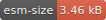
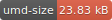

<p align="center"><a href="http://tram-one.io/" target="_blank"></a></p>

<div align="center">
  <a href="https://www.npmjs.com/package/tram-one">
    
  </a>
  <a href="https://www.npmjs.com/package/tram-one">
    
  </a>
  <a href="https://www.npmjs.com/package/tram-one">
    
  </a>
</div>
<div align="center">
  <a href="https://www.npmjs.com/package/tram-one">
    
  </a>
  <a href="https://unpkg.com/tram-one">
    
  </a>
  <a href="https://join.slack.com/t/tram-one/shared_invite/enQtMjY0NDA3OTg2MzQyLWUyMGIyZTYwNzZkNDJiNWNmNzdiOTMzYjg0YzMzZTkzZDE4MTlmN2Q2YjE0NDIwMGI3ODEzYzQ4ODdlMzQ2ODM">
    
  </a>
</div>

# Tram-One

Batteries Included View Framework
<br>
<br>

## Install
```sh
npm install tram-one --save
```

## Summary
Tram-One is a view framework for developers who want to jump straight into
building on the web. At its core, Tram-One is a collection of a few packages
that gives you the tools to start working right away. That is to say...
Batteries Included!

### Why?
Tram-One is a project built to make exposing custom elements easy, and to
have redux-like state management, and basic routing by default. It was created
out of  the frustration of having to scaffold the same dependencies over and over
again.

Tram-One was also created to avoid a lot of the syntax that locks you into
frameworks like Vue and React. The components written here can mimic the syntax
you're already familiar, or help you create pure HTML friendly code.

### Some Assembly Required
While Tram-One comes with several packages to help you on your way, it does
not include a way to bundle and run your code. The obvious answers are
[webpack](https://www.npmjs.com/package/webpack),
[browserify](https://www.npmjs.com/package/browserify),
[budo](https://www.npmjs.com/package/budo), etc...

If you want to quickly get started though, use
[tram-one express](https://www.npmjs.com/package/tram-one-express)!

```
$ npm install -g tram-one-express
$ tram-one-express app-name
```

Tram-One Express builds a local project with everything you need to get started
developing! It includes all the dependencies and some example code to help you
get familiar with Tram-One.

## Packages
Tram-One is a collection of excellent packages (and
[some](https://github.com/Tram-One/hyperx) [forks](https://github.com/JRJurman/bel-create-element)).<br>
Here are the different package that make Tram-One possible...

For Rendering:
  - [hyperx](https://github.com/Tram-One/hyperx)
  - [bel-create-element](https://github.com/JRJurman/bel-create-element)
  - [rbel](https://github.com/aaaristo/rbel)
  - [nanomorph](https://github.com/choojs/nanomorph)

For Routing:
  - [rlite](https://github.com/chrisdavies/rlite)
  - [url-listener](https://github.com/JRJurman/url-listener)

For State Management:
  - [hover-engine](https://github.com/JRJurman/hover-engine)

While not used in this project, Tram-One is heavily inspired by the
[choo](https://github.com/choojs/choo) view framework.
Special thanks go out to the people on that project, and its
creator, [Yoshua Wuyts](https://github.com/yoshuawuyts).
If you like some of the things here, definitely
[go check out that project](https://github.com/choojs).

## Video Tutorial
This video tutorial goes through the process of build a Tram-One web app
from start to finish.

While it does not go into depth on all the things you can do with Tram-One,
it's a great introduction to help you get started building a Tram-One app.

Link: https://youtu.be/mgHJbqls-wk

## Examples

### Annotated Examples
<details>
<summary>
Here is a tiny example, the bare-minimum for
creating an app.
</summary>

```js
Tram = require('tram-one')    // pull in the library
const app = new Tram()        // create an instance of Tram-One

// create the html function
const html = Tram.html()

// home page to load on the main route
const home = () => {

  // we use html takes in a template literal of your standard HTML
  return html`
    <div>
      🚋 Fun Times on Tram-One!
    </div>
  `
}

// add routes, by using path matchers with function components
app.addRoute('/', home)

// attach the app to an element with the class 'main'
app.start('.main')
```

</details>

<details>
<summary>
Here is an example which makes use of the custom
element, routing, and redux state management.
</summary>

```js
Tram = require('tram-one')    // pull in the library
const app = new Tram()        // create an instance of Tram-One

// create the html function, with no registry
const html = Tram.html()

// create a custom element to display a color option
const colorElement = (attrs, children) => {
  return html`
    <button onclick=${attrs.onclick}>${children}</button>
  `
}

// create a new html function, with color-button
// the key can be any format, capitalize, kebab, whatever!
const cHtml = Tram.html({
  'color-button': colorElement
})

// create a set of actions, that handles changing the color of the app
const colorActions = {
  init: () => 'blue',
  setColor: (currentColor, newColor) => newColor
}

// home page to load on the main route
const home = (store, actions) => {

  // actionCreator that dispatches to the reducer
  const onSetColor = (color) => () => {
    actions.setColor(color)
  }

  // we use cHtml so that we have color-button available in the template
  return cHtml`
    <div>
      I think the best color for this wall is... ${store.color}!
      or maybe it's...
      <color-button onclick=${onSetColor('blue')}>blue</color-button>
      <color-button onclick=${onSetColor('red')}>red</color-button>
      <color-button onclick=${onSetColor('green')}>green</color-button>
    </div>
  `
}

// add routes, by using path matchers with function components
app.addRoute('/', home)
app.addRoute('/404', noPage)

// add actions and save the state as `color` on the store
app.addActions({color: colorActions})
app.start('.main')
```

</details>

### Internal Examples
You can find more examples in the
[examples directory](https://github.com/JRJurman/tram-one/tree/master/examples).<br>
You can run these examples by cloning the repo, and running
```sh
npm install
npm run example
```

### Real Projects out in the world!
Here are some most bodacious examples out in the real world
* [Point-Cards](https://github.com/JRJurman/point-cards) - A planning poker web app that uses websockets (Tram-One v1)
* [Hacktober & Tram-One](https://github.com/Tram-One/hacktoberfest) - A static github pages app that pulls github issues for Hacktoberfest (Tram-One v2)
* [Cocktail-Curator](https://github.com/chtinahow/cocktail-curator) - A mixing drinks app that is powered by a server and external API (Tram-One v2)

## API
Tram-One has a simple interface to help build your web app.

### `Tram.html([registry])`
_Reference: [hyperx](https://github.com/substack/hyperx),
[bel-create-element](https://github.com/JRJurman/bel-create-element),
[rbel](https://github.com/aaaristo/rbel)_

`Tram.html` returns a function that can be used to transform
template literals into Node DOM trees.
It can take in an optional `registry`, which is a mapping of tag
names to functions that render your custom tags.

Because it is static, you call the function off of Tram-One, you
do not need to have an instance of Tram-One to use this function.

<details>
<summary>
Example:
</summary>

```js
/* pageWraper.js (custom element) */
const html = Tram.html()

module.exports = (attrs, children) => {
  return html`
    <div style=${attrs.style}>
      <h1>Tram-One!</h1>
      <div style='padding-left: 2em'>
        ${children}
      </div>
    </div>
  `
}

/* index.js */
const pageWraper = require('./pageWraper')
const html = Tram.html({
  // can map with kebab
  'page-wraper': pageWraper,
  // or with capitalization
  'PageWraper': pageWraper,
  // or whatever
  'wrap': pageWraper
})

const home = () => {
  return html`
    <wrap>
      This is my shiny app!
    </wrap>
  `
}
```

</details>

### `Tram.constructor([options])`
`new Tram()` returns an instance of the Tram. The constructor
takes in an `options` object, which can have a `defaultRoute`.

`defaultRoute` by default is `/404`, but you can set it to whatever path
you want to load when path matching fails.

<details>
<summary>
Example:
</summary>

```js
/* index.js */
// let's have all routes go to home
const app = new Tram({defaultRoute: '/'})
const html = Tram.html()

const home = (state) => {
  return html`<div>This is my shiny app!</div>`
}

app.addRoute('/', home)
```

</details>

### `app.addActions(actionGroups)`
_Reference: [hover-engine](https://github.com/JRJurman/hover-engine)_

`app.addActions` adds a set of actions that can be triggered in the instance of Tram-One.
It takes in one argument, an object where:<br>
the keys are values that can be pulled in the view<br>
the values are actions that can be triggered in the view<br>

<details>
<summary>
Example:
</summary>

```js
/* index.js */
const app = new Tram()
const html = Tram.html()

// in this example, `vote` is a number
// but in a larger app, this could be an object
// with multiple key-value pairs
const voteActions = {
  init: () => 0,
  up: (vote) => vote + 1,
  down: (vote) => vote - 1
}

const home = (state, actions) => {
  const upvote = () => {
    actions.up()
  }
  const downvote = () => {
    actions.down()
  }

  return html`
    <div>
      <h1> Votes: ${state.votes} </h1>
      <button onclick=${upvote}>UPVOTE</button>
      <button onclick=${downvote}>DOWNVOTE</button>
    </div>
  `
}

app.addActions({votes: voteActions})
```

</details>

### `app.addListener(listener)`
_Reference: [hover-engine](https://github.com/JRJurman/hover-engine)_

`app.addListener` adds a function that triggers on every action call Tram-One. This can be used to
save state in localstorage, or to debug the state of the store as actions are called. This should
not be used to update the DOM, only trigger side-effects.

It takes in one argument, a function, which provides 2 arguements, the store and actions:<br>
the store contains the key-value pair that you get as the first parameter for pages<br>
the actions is an object of callable functions that you get as the second parameter for pages<br>

In many ways it is the same values you are provided when building a Page with `addRoute`.

<details>
<summary>
Example:
</summary>

```js
/* index.js */
const app = new Tram()
const html = Tram.html()

// in this example, `vote` is a number
// but in a larger app, this could be an object
// with multiple key-value pairs
const voteActions = {
  init: () => 0,
  up: (vote) => vote + 1,
  down: (vote) => vote - 1
}

const home = (state, actions) => {
  const upvote = () => {
    actions.up()
  }
  const downvote = () => {
    actions.down()
  }

  return html`
    <div>
      <h1> Votes: ${state.votes} </h1>
      <button onclick=${upvote}>UPVOTE</button>
      <button onclick=${downvote}>DOWNVOTE</button>
    </div>
  `
}

// we want to debug the store as votes come in
const debug = (store, actions) => {
  console.log(store)
}

app.addListener(debug)
app.addActions({votes: voteActions})
```

</details>

### `app.addRoute(path, page)`
_Reference: [rlite](https://github.com/chrisdavies/rlite)_

`app.addRoute` will associate a component with a route.<br>
`path` should be a matchable route for the application. Look up
[rlite](https://github.com/chrisdavies/rlite)
to see all the possible options here.<br>
`page` should be a function that takes in a `store`, `actions` and `params`.

The `params` object passed into the `page` function will have any path parameters and query params.

<details>
<summary>
Example:
</summary>

```js
/* index.js */
const app = new Tram()
const html = Tram.html()

const homePage = () => {
  return html`<div>This is my shiny app!</div>`
}

const colorPage = (store, actions, params) => {
  const style = `
    background: ${params.color};
    width: 100px;
    height: 100px;
  `
  return html`<div style=${style} />`
}

const noPage = () => {
  return html`<div>Oh no! We couldn't find what you were looking for</div>`
}

app.addRoute('/', homePage)
app.addRoute('/:color', colorPage)
app.addRoute('/404', noPage)
```

</details>

### `app.start(selector, [pathName])`

`app.start` will kick off the app. Once this is called the app is mounted onto the
`selector`.<br>
`selector` can be a node or a css selector (which is fed into
`document.querySelector`).<br>
`pathName` can be an initial path, if you don't want to check the browser's
current path.

This method only works on the client. If you are running Tram on a server, then
use `.toString()`.

Note: setting `pathName` is great for testing, but prevents other routes from
being reached on page reload.

<details>
<summary>
Example:
</summary>

```html
/* index.html */
<html>
  <head>
    <title>Tram One</title>
  </head>
  <body>
    <div class="main"></div>
    <script src="/index.js"></script>
  </body>
</html>
```

```js
/* index.js */
const app = new Tram()
const html = Tram.html()

const homePage = (state) => {
  return html`<div>This is my shiny app!</div>`
}

app.addRoute('/', homePage)
app.start('.main')
```

</details>

### `app.mount(selector, pathName, store, actions)`
**WARNING: INTENDED FOR INTERNAL USE ONLY**

`app.mount` matches a route from `pathName`, passes in a `store` and `actions` object,
and either creates a child div, or updates a child div under `selector`.

This was created to clean up the code in the library, but may be useful for
testing.

**YOU SHOULD NEVER CALL THIS DIRECTLY FOR YOUR APP**

### `app.toNode(pathName[, store, actions])`

`app.toNode` returns a HTMLNode of the app for a given route and store. The
function matches a route from `pathName`, and either takes in a `store`, or
uses the default store (that's been created by adding reducers).

While initially created to clean up the code in the library, this can be useful
if you want to manually attach the HTMLNode that Tram-One builds to whatever.

### `app.toString(pathName[, store])`

`app.toString` returns a string of the app for a given route and store. It has
the same interface at `app.toNode`, and basically just calls `.outerHTML` (or
`toString` on the server) on the node.

This can be useful if you want to do server-sider rendering or testing.

## Development

### Slack

If you want to start contributing, need help, or would just like to say hi, [join our slack channel](https://join.slack.com/t/tram-one/shared_invite/enQtMjY0NDA3OTg2MzQyLWUyMGIyZTYwNzZkNDJiNWNmNzdiOTMzYjg0YzMzZTkzZDE4MTlmN2Q2YjE0NDIwMGI3ODEzYzQ4ODdlMzQ2ODM)!

### Commands

If you decide to clone this repo, there are several commands included in the
`package.json` to help you develop.
- `npm run lint`, runs eslint in the project
- `npm run example`, kicks off one of the example apps in this repo
- `npm run build`, builds the project and creates a distributable
- `npm run test-dev`, hosts the tests to be launched in a browser
- `npm run test`, runs tests against all available browsers on the machine

### Todo

Check out our [Issues on Github](https://github.com/JRJurman/tram-one/issues).
PRs welcome!
